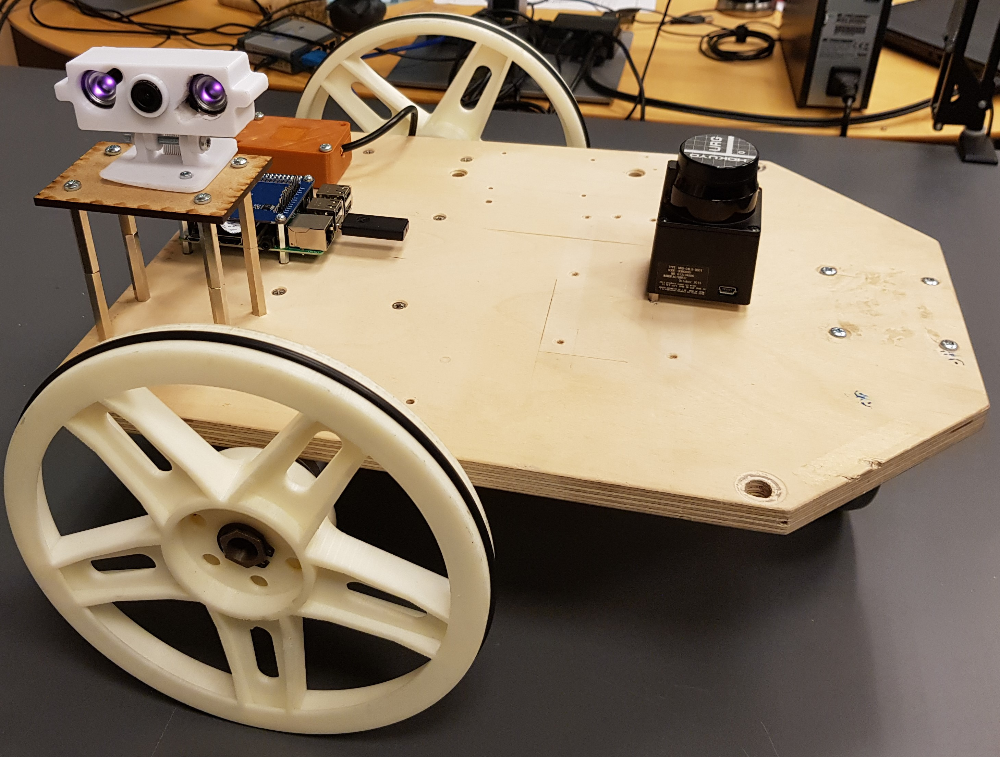

# Experts in Team Project - Autonoumous Fence Inspection Robot

This project is about making a prototype fence inspection mobile robot to detect holes in fences along an airport. The mobile robot platform used is the SDU Frobit seen below.

| The prototype platform SDU Frobit |
|:------------------------:|
|  |

The project can both run in ros-gazebo simulation and on the frobit itself in real life. 

## Real life

Due to LIDAR limits the frobit was not able to detect lines along an fence. However it could detect lines a more dense structure such as a building. The frobit driving using the PID controller as distance control is illustrated below. 

| Straight section | Corner section | Fence following | 
|:----------------:|:--------------:|:---------------:|
|  |  | | 

## Simulation
|  Dog-bone map ICO |  Square map ICO | Airport map ICO |
|:-----------------:|:---------------:|:---------------:|
|  |  |  |

## Vision
The vision folder contains the different algorithm used to detect holes in the fence. Below is a small example of one of the nueral network for hole detection.

|  YOLOv5 sim example |  YOLOv5 real example |
|:-------------------:|:--------------------:|
|  |  |