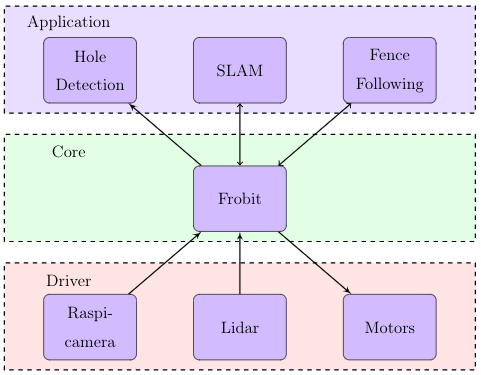
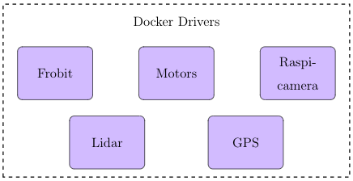
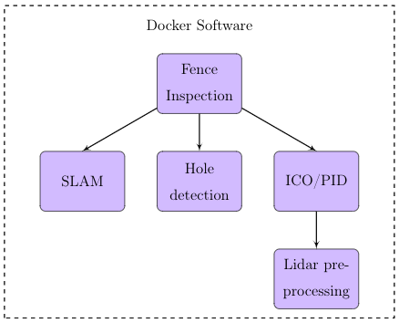

# Frobit drivers and nodes

This folder contains all the dockers and files needed to run the fence inspection software on the frobit platform. The structure of the dockers running can be seen below

| Structure of the dockers |
|:------------------------:|
|  |

Inside the frobit folder a docker compose file is present, which takes care of building and running all the dockers as well as starting a ROS-CORE. All the containers can be seen below.

| Drivers | Applications |
|:-------:|:------------:|
|  |  |