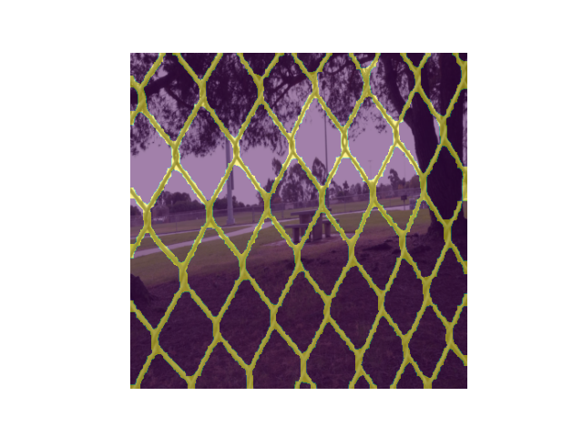

# Sematic Segmentation for Fence Detection

This folder explores the use of sematic segmentation methods for segmenting the fence in a image.

The dataset [Fence Segmentation Dataset](https://github.com/chen-du/De-fencing) is used to train the different models. Examples of the used data can be seen below:

| Real image | Real mask |
|:-:|:-:|
|  |  |

## U-Net

A U-Net model is trained on both the [Fence Segmentation Dataset](https://github.com/chen-du/De-fencing).

## SegNet

A SegNet model is trained on both the [Fence Segmentation Dataset](https://github.com/chen-du/De-fencing).

## DeepLabV3 with ResNet50

A DeepLabV3 model is trained on both the [Fence Segmentation Dataset](https://github.com/chen-du/De-fencing).

| Prediction 0 | Prediction 13 | Prediction 30 | Prediction 97 |
|:------------:|:-------------:|:-------------:|:-------------:|
|  |  |  |  |

Loss 0.0909(+/-0.0405) and accuracy 0.9684(+/-0.0083) on test dataset.

For more information see [deeplab/README.md](deeplab/README.md).

## References

- [Deep learning based fence segmentation andremoval from an image using a video sequence](https://arxiv.org/pdf/1609.07727.pdf)
- [My camera can see through fences: A deep learningapproach for image de-fencing](https://arxiv.org/pdf/1805.07442.pdf)
- [Single-Image Fence Removal Using DeepConvolutional Neural Network](https://ieeexplore.ieee.org/stamp/stamp.jsp?arnumber=8933392)
- [U-Net: Convolutional Networks for BiomedicalImage Segmentation](https://arxiv.org/pdf/1505.04597.pdf)
- [SegNet: A Deep Convolutional Encoder-DecoderArchitecture for Image Segmentation](https://ieeexplore.ieee.org/stamp/stamp.jsp?arnumber=7803544)
- [Fence Segmentation Dataset](https://github.com/chen-du/De-fencing)
- [synth-ml](https://gitlab.com/sdurobotics/vision/synth-ml)
