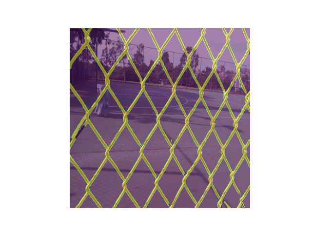
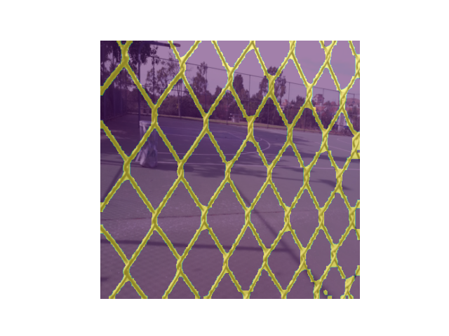
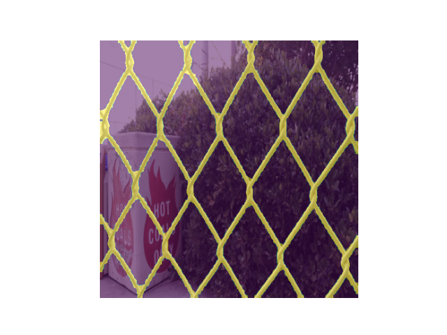

# Fence detection

This folder explores how the use of deeplearning can detection holes in fences or structure of fences. Hole detection is handled as a object detection problem, and identifying the structure of the fence is handled as a semantic segmentation problem.

## Object Detection of Holes in Fences

The dataset for hole detection is a combination of images of fences with holes from google, synthetic images with a fence 3D CAD model, and images with holes created in GIMP. Examples can be seen below.

| Image from google | Synthetic crated images | Images with holes crated in GIMP |
|:-:|:-:|:-:|
|  |  |  |
|  |  |  |
|  |  |  |

The synthetic images was created with [synth-ml](https://gitlab.com/sdurobotics/vision/synth-ml).

The results of the different method tested (Faster R-CNN, YOLOv5, and SSD MobileDet) can be seen below.

| Method | Epochs | mAP@0.5 (%) | Prediction time (ms) |
|:------:|:------:|:-----------:|:--------------------:|
| Faster R-CNN | 200 | 94.80 | 17.03 (GPU - GTX 1050 ti) |
| YOLOv5 | 300 | 98.9 | 18.60 (GPU - GTX 1050 ti) |
| SSD MobileDet | 2461 | 87.10 | 8.00 ([Edge TPU - USB Accelerator](https://coral.ai/docs/accelerator/datasheet/)) |

### Experiments

The SSD MobileDet and YOLOv5 was tested in simulation and real world.

| Method | YOLOv5 | SSD MobileDet |
|:------:|:------:|:-------------:|
| Simulation |  |  |
| Real world |  |  |

## Sematic Segmentation for Fence Detection

The dataset [Fence Segmentation Dataset](https://github.com/chen-du/De-fencing) is used to train the different models. Examples of the used data can be seen below:

| Real image | Real mask |
|:-:|:-:|
|  |  |

### U-Net

A U-Net model is trained on both the [Fence Segmentation Dataset](https://github.com/chen-du/De-fencing).

| Prediction 0 | Prediction 13 | Prediction 30 | Prediction 97 |
|:------------:|:-------------:|:-------------:|:-------------:|
|  |  |  |  |

Loss 0.3353(+/-0.0068) and accuracy 0.9770(+/-0.0071) on test dataset.

For more information see [unet/README.md](unet/README.md).

### DeepLabV3 with ResNet50

A DeepLabV3 model is trained on both the [Fence Segmentation Dataset](https://github.com/chen-du/De-fencing).

| Prediction 0 | Prediction 13 | Prediction 30 | Prediction 97 |
|:------------:|:-------------:|:-------------:|:-------------:|
|  |  |  |  |

Loss 0.0909(+/-0.0405) and accuracy 0.9684(+/-0.0083) on test dataset.

For more information see [deeplab/README.md](deeplab/README.md).

## References

- [Deep learning based fence segmentation andremoval from an image using a video sequence](https://arxiv.org/pdf/1609.07727.pdf)
- [My camera can see through fences: A deep learningapproach for image de-fencing](https://arxiv.org/pdf/1805.07442.pdf)
- [Single-Image Fence Removal Using DeepConvolutional Neural Network](https://ieeexplore.ieee.org/stamp/stamp.jsp?arnumber=8933392)
- [U-Net: Convolutional Networks for BiomedicalImage Segmentation](https://arxiv.org/pdf/1505.04597.pdf)
- [SegNet: A Deep Convolutional Encoder-DecoderArchitecture for Image Segmentation](https://ieeexplore.ieee.org/stamp/stamp.jsp?arnumber=7803544)
- [Fence Segmentation Dataset](https://github.com/chen-du/De-fencing)
- [synth-ml](https://gitlab.com/sdurobotics/vision/synth-ml)
