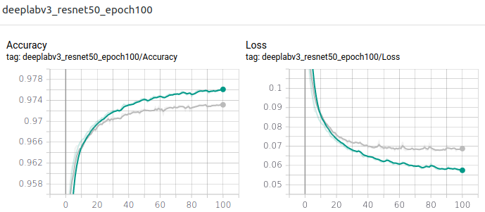
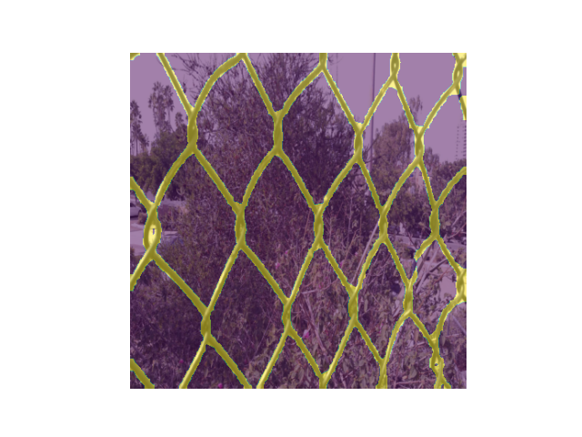
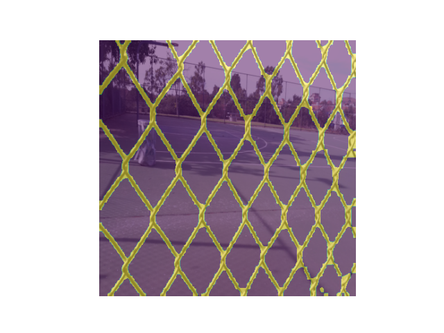
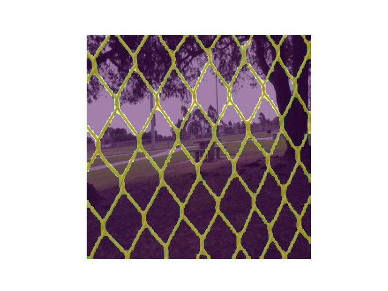
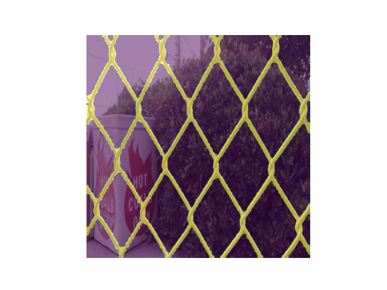

# DeepLabV3+ for Semantic Segmentation

## Results from training

### ResNet: 50 - Epoch: 100 - Learning rate: 1.e-4 - Weight decay: 1e-5

| Plot of loss and accuracy (train is green and validation is grey) |
|:-----------------------------------------------------------------:|
|  |

| Prediction 0 | Prediction 13 | Prediction 30 | Prediction 97 |
|:------------:|:-------------:|:-------------:|:-------------:|
|  |  |  |  |

Loss 0.0909(+/-0.0405) and accuracy 0.9684(+/-0.0083) on test dataset.

## References

- [Rethinking Atrous Convolution for Semantic Image Segmentation](https://arxiv.org/pdf/1706.05587.pdf)
- [Torchvision - semantic segmentation](https://pytorch.org/docs/stable/torchvision/models.html#semantic-segmentation)