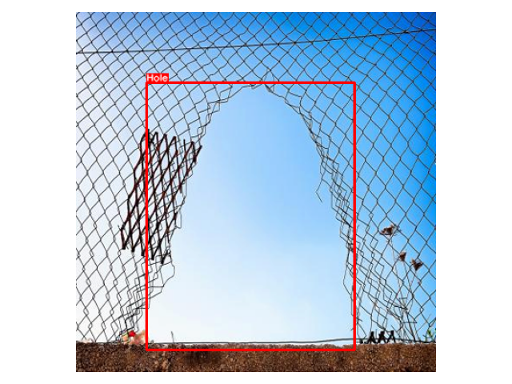

# Faster Region-based Convolutional Neural Network

## Holes in Fences

The results of the validation set can be seen below:

| mAP@0.5:0.95 | mAP@0.5 | mAP@0.75 | Model time | Epochs |
|:------------:|:-------:|:--------:|:----------:|:-------:|
| 0.793 | 0.948 | 0.879 | 0.1703 | 200 |

The learning curve can be seen below:

| Learning curve |
|:--------------:|
|  |

Some predections can be seen below:

| Hole 001 | Hole 006 | Hole 042| Hole 045 |
|:--------:|:--------:|:-------:|:--------:|
|  |  | |  |
