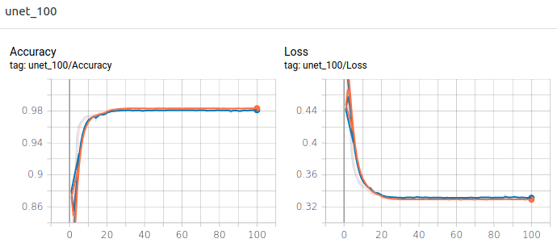
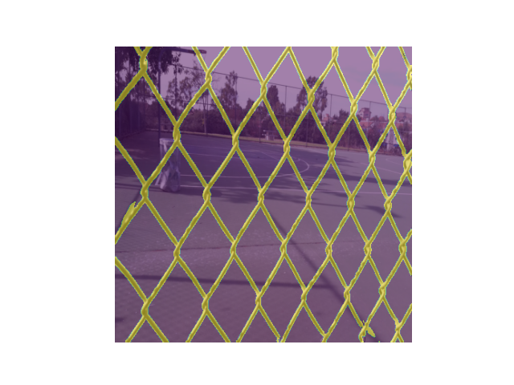
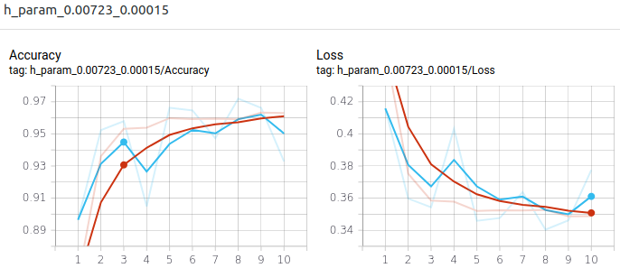
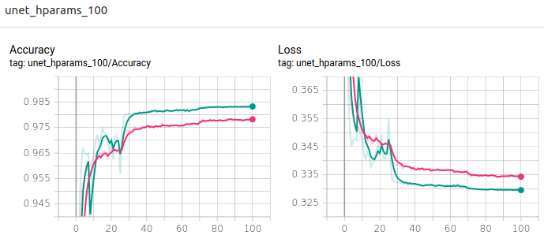
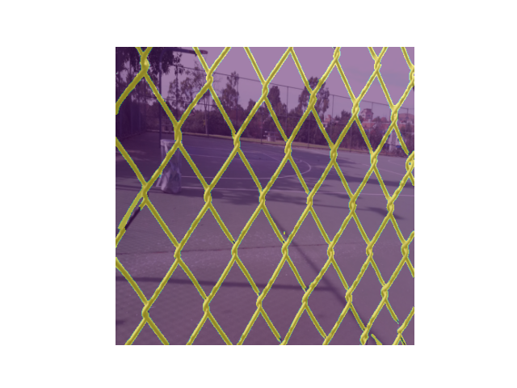

# UNet for Semantic Segmentation

## Results from training

### Learning rate: 1e-3 - Weight decay: 1e-5 - Batch size: 1

| Plot of loss and accuracy (train is orange and validation is blue) |
|:-----------------------------------------------------------------:|
|  |

| Prediction 0 | Prediction 13 | Prediction 30 | Prediction 97 |
|:------------:|:-------------:|:-------------:|:-------------:|
|  |  |  |  |

Loss 0.3369(+/-0.0082) and accuracy 0.9752(+/-0.0085) on test dataset.

### Hyperparameter optimization

Best hyperparameters found: Batch size: 2, learning rate: 0.00723, and weight decay: 0.00014, that after 10 epochs got an accuracy of 0.9719 on validation.

| Plot of loss and accuracy (train is orange and validation is blue) |
|:-----------------------------------------------------------------:|
|  |

### Batch size: 2 - learning rate: 0.00723 - Weight decay: 0.00014

| Plot of loss and accuracy (train is purple and validation is blue) |
|:-----------------------------------------------------------------:|
|  |

| Prediction 0 | Prediction 13 | Prediction 30 | Prediction 97 |
|:------------:|:-------------:|:-------------:|:-------------:|
|  |  |  |  |

Loss 0.3353(+/-0.0068) and accuracy 0.9770(+/-0.0071) on test dataset.

## References

- [U-Net for brain segmentation](https://github.com/mateuszbuda/brain-segmentation-pytorch)
- [U-Net: Convolutional Networks for BiomedicalImage Segmentation](https://arxiv.org/pdf/1505.04597.pdf)
